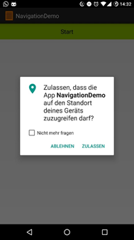
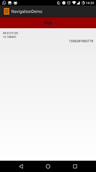

# U10a | Location

## Downloads

- [Download des Starterpakets](https://github.com/Android-Regensburg/U10a-Location/archive/master.zip)
- [Download des Lösungsvorschlag](https://github.com/Android-Regensburg/U10a-Location/archive/solution.zip)

## Aufgabe

Erstellen Sie eine simple Anwendung auf Basis der Location Based Service-Inhalte, die es dem Benutzer erlaubt die aktuelle Position des Geräts zu speichern. 

## Hinweise

* LBS: Sie benötigen den `LocationManager` für die Abfragen der aktuellen Position und das `Location`-Object zur Speicherung der Ortsinformationen und zur Berechnung von Distanz und Richtung. Informationen und Beispiele finden Sie in den aktuellen Vorlesungsfolien.

* Permissions: Denken Sie daran, im Manifest die nötigen Permissions für den Zugriff auf den `LocationProvider` einzutragen. Außerdem muss der Benutzer bestätigen, dass die App berechtigt ist auf diesen zuzugreifen.

* Überprüfen Sie in Ihrem Smartphone unter Einstellungen -> Apps -> NavigationDemo ob die Berechtigungen angezeigt werden.

* Überprüfen Sie ob der Zugriff auf den Standort auf Ihrem Gerät gewährt wird.

## Vorgehen

## Anleitung

### Erste Schritte

1. Laden Sie das vorgegebene Projekt herunter und öffnen Sie es. Das Layout muss nicht geändert werden. Große Teile des Codes sind bereits vorgegeben. Schauen Sie sich alle Klassen sowie den vorgegebenen Code genau an, bevor Sie mit der Implementierung beginnen.

2. Das Android Manifest muss um die Permission für die Abfrage des Standortes ergänzt werden (in diesem Fall wollen wir Fine_Location).

### Main Activity 

1. Als Erstes müssen Sie prüfen, ob die nötigen Berechtigungen vom User erteilt wurden, damit Sie in der App später auf die Location zugreifen können. Das machen Sie bevor Sie Ihre Views und Variablen initialisieren. Über `ContextCompat.checkSelfPermission` können Sie die benötigten Berechtigungen abfragen. Diese muss dann mit `PackageManager.PERMISSION_GRANTED` verglichen werden. Haben Sie die benötigte Berechtigung erhalten, können Sie die App nun initialisieren. Wennnicht, starten Sie eine Anfrage, um die benötigten Rechte zu erhalten. Die Abfrage starten wir über die `ActivityCompat` Klasse mit requestPermission.

2. Nun muss die Antwort auf die Frage, ob der User die Permissions erteilen will, richtig abgefangen werden. Dafür überschreiben Sie die Callback-Methode `onRequestPermissionsResult` und überprüfen den `requestcode`. Da wir nur eine Permission anfragen, reicht es die erste Stelle des Arrays `grantResults` zu überprüfen. Wenn die Permission erteilt wurde, können Sie mit den nächsten Schritten anfangen.

3. `initUI()` soll den Button mit einem OnClick Listener belegen und den Listview Adapter und die dazugehörige ArrayList initialisieren. Der Button soll zwischen Start und Stop wechseln. Dabei wechselt er seine Schrift und Farbe und stoppt und startet die Location Abfrage über den `NavigationController`.

4. Benutzen Sie `modifyButtonLayout`, um die Farbe und die Schrfit des Buttons zu verändern.

5. `saveCurrentPosition()` soll die aktuelle Location über den `NavigationController` abrufen und in der `ArrayList` `saved_location` speichern

### NavigationController

1. In `init()` wird der `LocationManager` über den übergebenen `Context` mit der Methode `getSystemService` referenziert und die letzte bekannte Position des GPS-Providers ausgelesen und genutzt, um `lastLocation` mit einem Wert zu belegen. Bevor sie mit `getLastKnownLocation` die letzte bekannte Position ermitteln, müssen sie einen Provider bestimmen (siehe `setBestProvider` Methode im nächsten Punkt).

2. Ergänzen Sie die Methode `setBestProvider()`, die keine Parameter erwartet und nichts zurückgibt. Erzeugen Sie in `setBestProvider` eine lokale Variable vom Typ `Criteria` und legen Sie eine Reihe an Kriterien für ihren Provider fest: Der resultierende String wird dann in der passenden Variable gespeichert.

3. `start()`: hier wird der `LocationListener` initialisiert und die Methode des LocationManagers `requestLocationUpdates` aufgerufen, um die Locations regelmäßig zu aktualisieren.

4. In `stop()` soll der `LocationListener` aufhören auf Updates zu lauschen.

### NavigationListener

1. Der `NavigationController` ermittelt zwar nun regelmäßig Location Updates und speichert diese in seiner Variablen, aber die `MainAcitivity` bekommt davon nichts mit und updatet darum nicht die Liste mit den Locations.

2. Erstellen Sie deswegen ein neues Interface namens `NavigationListener`.

3. Implementieren Sie die benötigten Methoden.

4. Referenzieren Sie das Interface richtig in der `MainActivity` und dem `NavigationController`. Der `NavgationController` soll mit Hilfe des Interfaces die `MainActivity` über Updates benachrichtigen.

5. Rufen Sie die Methoden des Interfaces in `NavigationController` an geeigneten Positionen auf.

6. Implementieren und überschreiben Sie die notwendigen Methoden des Interfaces in der `MainActivity`.

## Anhang
### Screenshots

